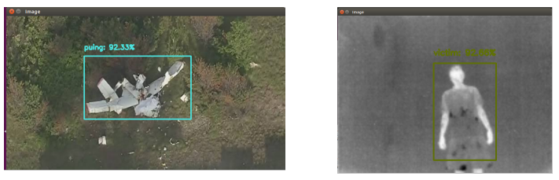

# Thermalvictim
This work is based on my final project thesis on my bachelor degree of mechatronics

This research is about detecting airplane wreckages from webcam camera and victim from thermal camera using Deep Learning CNN using MobileNet-SSD architecture

# How to use
1. Install opencv , numpy, imutils
2. Specify the location of the model and the image 
3. Run the .py file

# Preview

